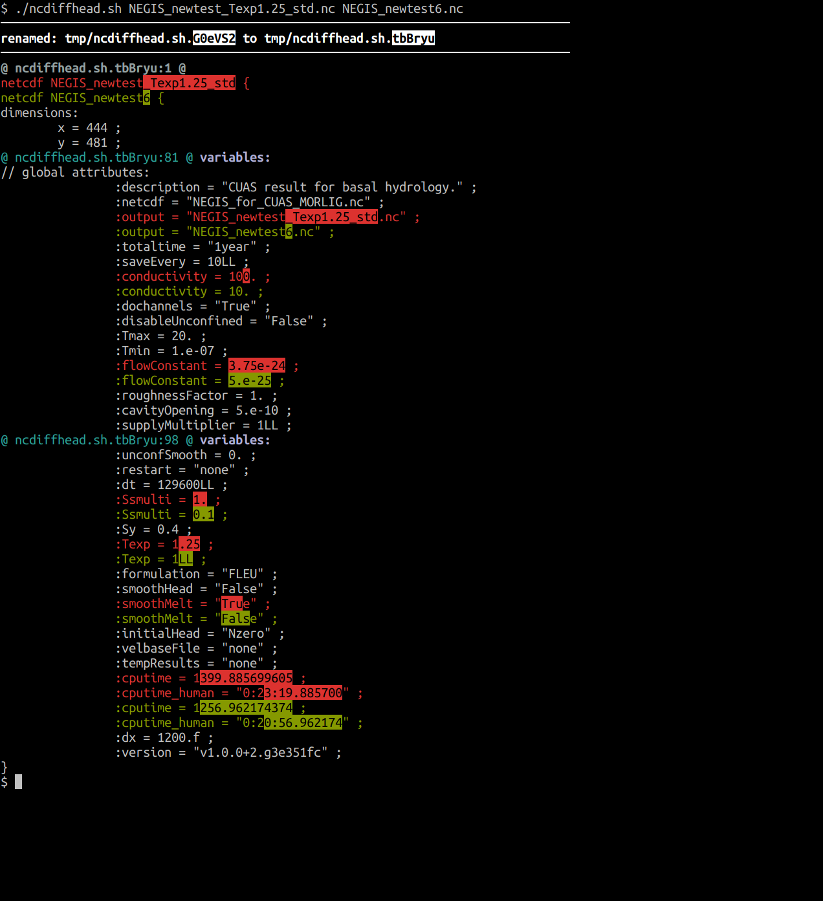
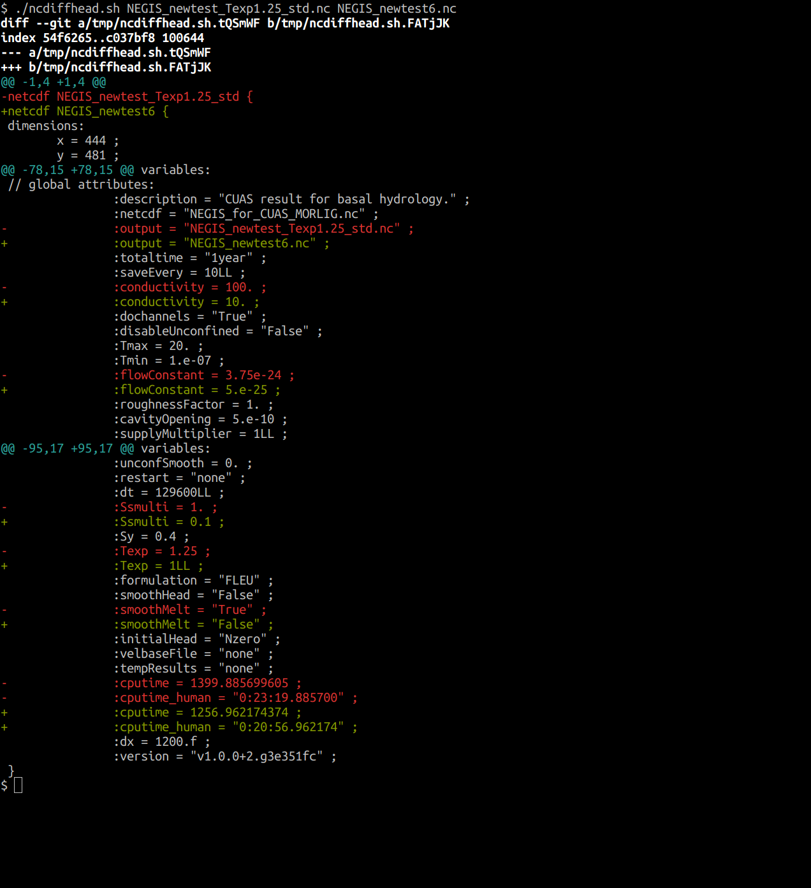

# ncdiffhead

Need to compare which variables you have set on different model runs?
Getting crazy comparing each line of `ncdump -h` by hand?
Search no longer! `ncdiffhead` to the rescue!


```
./ncdiffhead.sh file1.nc file2.nc
```




or without [diff-so-fancy](https://github.com/so-fancy/diff-so-fancy)

